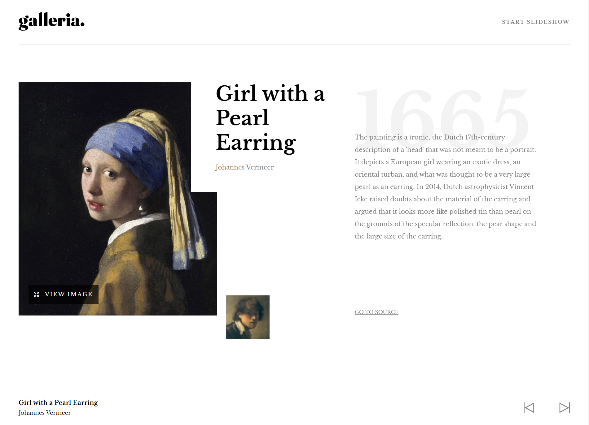

### The challenge

Users should be able to:

- View the optimal layout for the app depending on their device's screen size
- See hover states for all interactive elements on the page
- Navigate the slideshow and view each painting in a lightbox

### Screenshot

### Links

- Solution URL: [Add solution URL here](https://your-solution-url.com)
- Live Site URL: [https://galleria-slide.netlify.app/](https://galleria-slide.netlify.app/)

## My process

### Built with

- React
- SASS
- [React](https://reactjs.org/) - JS library

### What I learned

The masonry was definitely a challenge for me. I've learned a lot about it thanks to this challenge

### Continued development

I would want to make it possible for a user prepare their own slideshows

## Author

- Website - [nessi](nessi.dev)
- Frontend Mentor - [@Abrosss](https://www.frontendmentor.io/profile/Abrosss)
- Twitter - [@yourusername](https://www.twitter.com/@ronessu)

